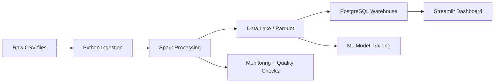

# Olist Data Engineering + Analytics + ML Project

## Architecture



## Setup

```bash
source ~/miniconda3/etc/profile.d/conda.sh
conda activate vicky
cd data-engineering-olist
pip install -r requirements.txt
```

## Execution Order

1. `python ingestion/ingest.py`
2. `python spark_jobs/transform.py`
3. `python warehouse/load_to_postgres.py`
4. `python ml/train.py`
5. `python monitoring/quality_checks.py`
6. `streamlit run dashboard/app.py`

## Notes

- The project is designed for local development only.
- PostgreSQL is expected on localhost:5432 with user `postgres` and password `postgres`.
- Screenshots placeholder: [examples/screenshots](examples/screenshots)

## Future AWS Migration Plan

- Replace local file paths with S3-compatible storage.
- Move PostgreSQL to Amazon RDS or Redshift.
- Deploy Streamlit and ML workloads via ECS/Fargate or EC2.
- Add IAM-based access and CloudWatch monitoring.
